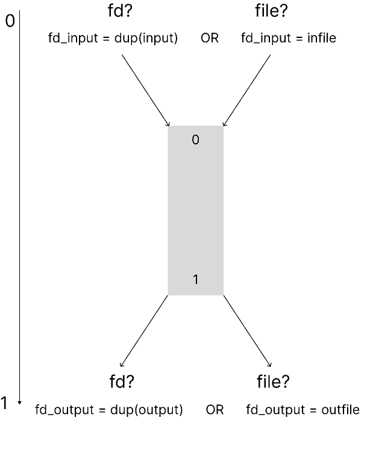
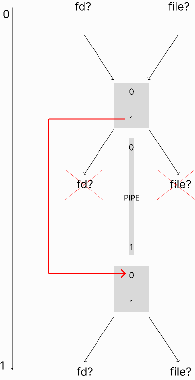

# Minishell README: Understanding Pipes and Builtins

## Pipes

### Where to start?

A file descriptor is a non-negative integer that uniquely identifies an opened file or a network .... bla, bla, bla.
The most important thing to memorize:
0 (Standard Input) - where we read
1 (Standard Output) - we we write
2 (Standard Error) - it exists and it’s amazing

### 
 We start with reading and after that writing... If we didn’t read, we can’t write...

During our experiments we are going to break everything down several times, so we need to create a copy of original fd, and play with them:

`int input = dup(0)` 
`int output = dup(1)`

Here we need to check if we have a file, if not we need to copy our input, cause we gonna do nasty things.

We remember that we read from 0, but now we have fd_input.
What to do? Redirect!

`dup2(fd_input, 0)`

Now we have a familiar and understandable 0... but...
This weird fd_input is on the way, let’s get rid of it!

`close(fd_input)`

Before going with the flow we need to figure out where our water goes: fd our outfile?

`if (infile)` 
  `  fd_input = infile;`
   
`else` 
  `  fd_input = dup(input);`
      

Cool cool cool

Let’s send the info! As I mentioned before we can write only to 1
Let’s get rid of weird fd_output and use beautiful 1

`dup2 (fd_output, 1)` 
`close(fd_output)`

 

### What if we have a pipe?

LOOP

We did the same thing:
Decided where we get information, redirected to 0, closed ugly fd_input.

In this case output can go only to the pipe, that’s why we don’t have freedom to choose outfile

Our pipe should also have file descriptors - it also wants to read and write, let’s give it to her:
`pipe(fdpipe)` - now our pipe fd’s can talk to each other

`fd_output = fdpipe[1]` 
`fd_input = fdpipe[0]`

Our program still claims to see 1 as a place where it can write, let’s give it:

`dup2 (fd_output, 1)` 
`close(fd_output)`

But now we see the second block/command that wants to get it’s part of the deal ...

 

- **First Command:**
  - Transformation of input: `0->(stdin or file)->0->fdpipe[0]`
  - Transformation of output: `1->fdpipe[1]->1`

- **Second Command:**
  - Transformation of input: `fdpipe[0]->0->fdpipe[0]`
  - Transformation of output: `1->fdpipe[1]->1`

- **Last Command:**
  - Transformation of input: `fdpipe[0]->0`
  - Transformation of output: `1->(stdin or file)->1`

### What does our parent do?

Waiting...
Waiting...
Waiting...
He wants to fix everything that was done and he redirects to our dear buddies - 0 and 1:

`dup2(input, 0)` 
`dup2(output, 1)`

and of course don’t forget to close our experiments:

`close(input)` 
`close(output)`

### Builtins

Minishell's built-in functions are executed by the parent process. For functions like `echo -n` and `exit`, their behavior is carefully managed:

- **Echo -n:** Both `-n` and `-nnnnnnnnn` prevent the trailing newline, ensuring precise output behavior.

- **Exit:**
  - If provided with one numeric argument, `exit` works as expected.
  - Multiple numeric arguments result in an error and prevent the exit.
  - Non-numeric arguments also trigger an error message.
  - Using `exit` alone writes "exit".

### Environment

First, I created a shorten copy of the environment variables **`envp_copy`** and started playing with them. Within this part I also created my ft_getenv that goes through the envp_copy.
There are 3 options for setting new variables:
1. The variable already exists and overwriting is forbidden:
   
  **`my_setenv("HOME", "test1", 0, &envp_copy)`**; //0 = overwrite is not allowed
  
  In this case we don't change the envp_copy.

  
2. The variable doesn't exist:

  **`my_setenv("TEST1", "test1", 1, &envp_copy)`**;
  
  We add 1 more line with our new variable.

  
3. The variable already exists and overwriting is allowed:

  **`my_setenv("OLDPWD", "/home/Desktop", 1, &envp_copy)`**; //1 = overwrite is allowed
  
  We delete old variable and add a new one.

Understanding these concepts is fundamental for Minishell development, enabling you to create a robust and efficient command-line interface. Happy coding! 🚀
